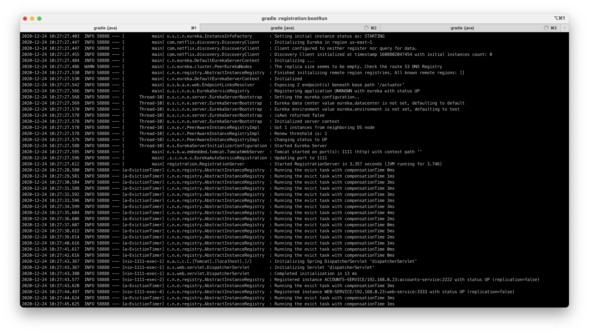

# Laboratory 6 - Microservices
Author: Hayk Kocharyan - 757715

## Running one instance of each service.
In first place we are going to run the registration service, next we wil run accounts and web service from diferent terminals. Each of this services will be run with:
``` 
# service = [ web | accounts | registration ]
gradle :service:bootRun 
```

* Registration service on port 1111.

* Accounts service on port 2222.

* Web service on port 3333.

* Eureka dashboard


## Running another accounts instance.
First of all we must change port number in applications.yml file for accounts module and the run the new instance with 
```
gradle :accounts:bootRun
```


## -   What happens when you kill the microservice  `accounts (2222)`  and do requests to  `web`?  Can the web service provide information about the accounts again? Why?

First we are goint to kill the service wth `Ctrl + c`.


Now we are going to check if the web service can provide accounts functionality.

* First check.

* Second check.


This is happening because we have another accounts service running on port 4444.


